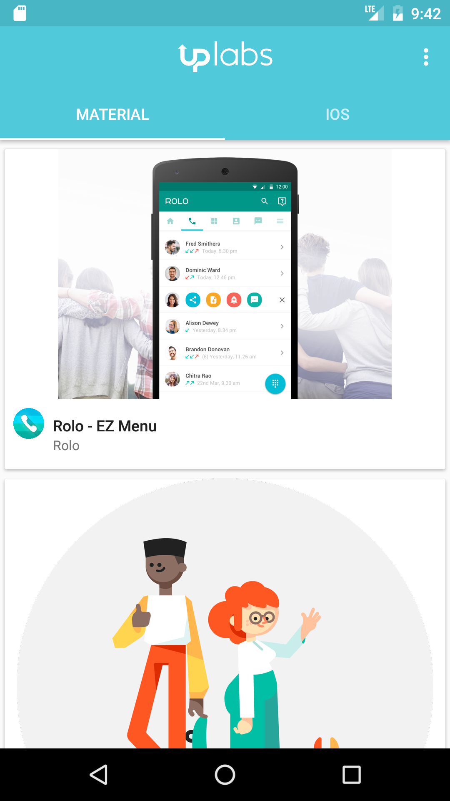
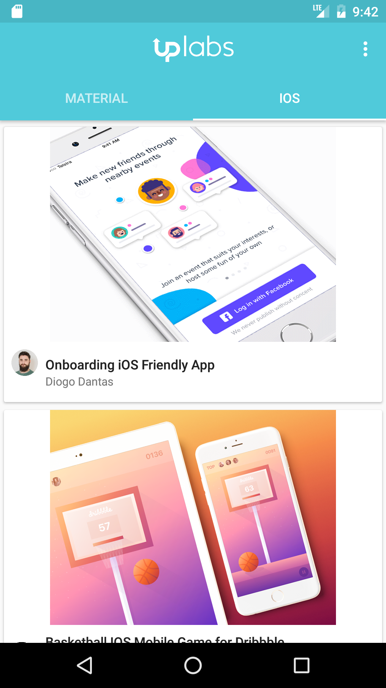

# UppLabs App
Kotlin Sample Project for Android

This is an example of Android using Kotlin, MVP pattern and others libraries.

## Kotlin
---
Kotlin version is [1.0.5-2](https://blog.jetbrains.com/kotlin/2016/11/kotlin-1-0-5-is-here/).

[Kotlin Android Roadmap](https://blog.jetbrains.com/kotlin/2016/03/kotlins-android-roadmap/)

Libraries
---------

 * Kotlin - http://kotlinlang.org
 * Dagger2 - http://google.github.io/dagger
 * OkHttp - http://square.github.io/okhttp
 * Retrofit - http://square.github.io/retrofit
 * Gson - https://github.com/google/gson
 * Picasso - https://github.com/square/picasso
 * RxJava - https://github.com/ReactiveX/RxJava
 * RxAndroid - https://github.com/ReactiveX/RxAndroid
 * RxKotlin - https://github.com/ReactiveX/RxKotlin
