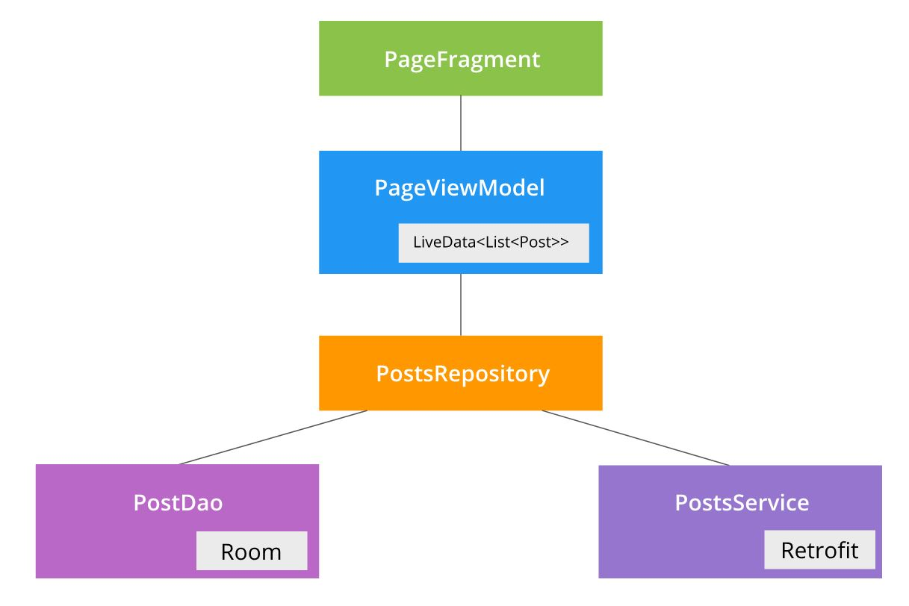
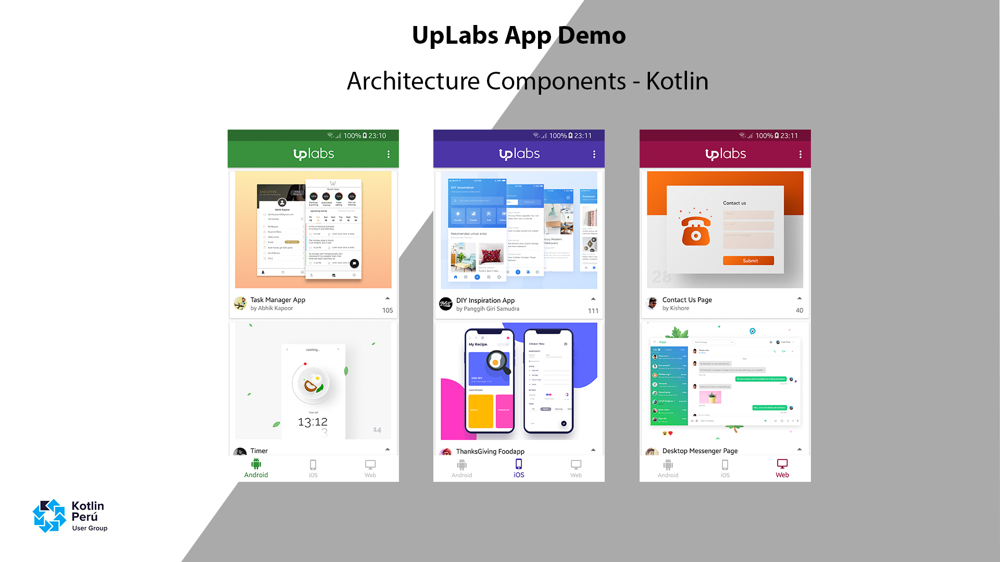

# Architecture Components - Kotlin
Kotlin Sample Project for Android

This is an example of Android using Kotlin and Android Architecture Components.

## Architecture
---

## Demo UpLabs
---

## Kotlin
---
 * Kotlin [1.1.60] - http://kotlinlang.org
 
## Libraries
---
 * Dagger2 [2.13] - http://google.github.io/dagger
 * Retrofit [2.3.0] - http://square.github.io/retrofit
 * RxJava2 [2.1.5] - https://github.com/ReactiveX/RxJava

## Resources
---
* https://developer.android.com/topic/libraries/architecture/index.html
* https://android.jlelse.eu/room-store-your-data-c6d49b4d53a3
* https://medium.com/google-developers/room-rxjava-acb0cd4f3757
* https://medium.com/google-developers/viewmodels-and-livedata-patterns-antipatterns-21efaef74a54